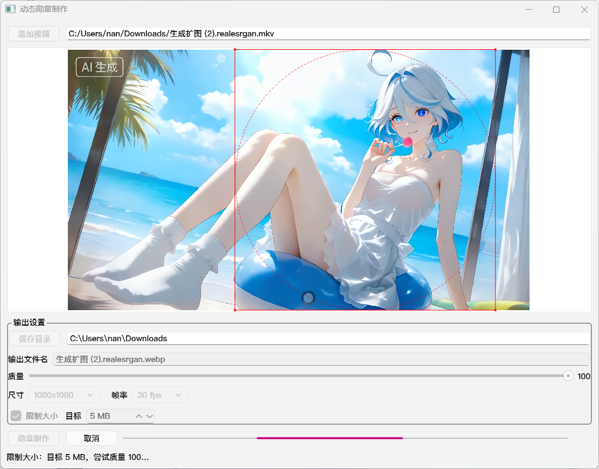

# dynamic_badge（动态勋章制作）

一个基于 PySide6 的小工具：从视频中选择一个正方形区域，裁成正方形后“内切圆形”，圆外区域变为透明，最后导出为带透明通道的动态 `webp`（循环播放）。

## 功能

- **添加视频**：选择本地视频文件并预览播放。
- **裁剪框**：显示红色正方形裁剪框，默认居中，可上下左右拖动（始终保持正方形且不超出画面）。
- **保存目录**：选择输出目录；默认是所选视频所在目录的绝对路径。
- **输出文件名**：默认与视频文件同名（含 `.webp`），可自定义；若未以 `.webp` 结尾会自动补全。
- **输出设置**：可视化设置 **质量/尺寸/帧率**（下拉选择）；可选 **限制大小（MB，默认 5）**（程序会尝试通过自动调整质量来逼近/不超过目标大小）。
- **勋章制作**：一键生成圆形透明动态 `webp` 并输出到保存目录。
 

## 工作原理（处理流程）

1. 使用 `ffprobe` 读取视频宽高。
2. 按裁剪框位置对原视频做 `crop` 得到正方形画面（裁剪坐标来自预览中的裁剪框，单位为原视频像素坐标）。
3. 对正方形画面做圆形透明遮罩：圆外像素 `alpha=0`（透明），圆内保持不变。
4. 使用 `ffmpeg` 的 `libwebp` 编码输出 `.webp`（循环、无音频）。

## 环境要求

- Windows / macOS / Linux（主要针对 Windows 使用）
- Python 3.10+（推荐 3.11/3.12）
- `PySide6`
- `ffmpeg` 与 `ffprobe`
  - 推荐：放到程序目录下的 `ffmpeg_bin/`（Windows 为 `ffmpeg.exe` / `ffprobe.exe`）
  - 或者安装到系统并确保在 `PATH` 中可直接执行 `ffmpeg`/`ffprobe`

## 安装依赖

```powershell
python -m venv .venv
.\.venv\Scripts\pip install -r requirements.txt
```

> 如果你使用的是 macOS/Linux，把 `.\.venv\Scripts\...` 改为 `.venv/bin/...`。

## 安装 ffmpeg / ffprobe（Windows）

任选一种方式即可：

1. 把 `ffmpeg.exe` 与 `ffprobe.exe` 放到 `ffmpeg_bin/` 目录（与 `main.py` 同级）。
2. 安装到系统并加入 `PATH`（例如使用 `winget` / `choco` / 手动下载安装包）。

验证是否安装成功：

```powershell
ffmpeg -version
ffprobe -version
```

## 运行

```powershell
.\.venv\Scripts\python .\main.py
```

## macOS 打包（Intel / Apple Silicon）

使用 PyInstaller 生成 macOS `.app` 并打包为 zip：

```bash
# 确保已安装打包工具
.venv/bin/pip install -U pyinstaller

bash scripts/build_macos.sh
```

输出：

- `dist/DynamicBadge-macos-x86_64.zip`（Intel）
- `dist/DynamicBadge-macos-arm64.zip`（Apple Silicon）

说明：

- 打包脚本会把 `ffmpeg_bin/` 内的 `ffmpeg`/`ffprobe` 一起拷贝进 `.app`，运行时不再依赖系统 PATH。
- 若要分别打包 Intel 与 Apple Silicon：需要在对应架构的 Mac 上执行打包，并确保 `FFMPEG_BIN_DIR`（可选）指向同架构的 `ffmpeg`/`ffprobe` 目录（默认使用本项目的 `ffmpeg_bin/`）。

## Windows 打包（x64）

1. 准备 `ffmpeg_bin\\ffmpeg.exe` 与 `ffmpeg_bin\\ffprobe.exe`（或设置环境变量 `FFMPEG_BIN_DIR` 指向包含它们的目录）。
2. 运行打包脚本：

```powershell
powershell -ExecutionPolicy Bypass -File scripts\build_windows.ps1
```

输出：

- `dist/DynamicBadge-windows-x64.zip`（解压后运行 `DynamicBadge.exe`，无需另装 ffmpeg）

## 使用说明

1. 点击 **添加视频**，选择视频文件。
2. 预览区域会开始循环播放，同时出现红色正方形裁剪框：
   - 默认边长为 **视频高度**（如果视频宽度小于高度，会自动取宽度，保证裁剪框不超出画面）。
   - 默认位置在画面正中间。
   - 可用鼠标拖动裁剪框到你希望的区域（只能平移，保持正方形；内圈虚线圆为最终裁剪边界）。
   - 可拖动裁剪框四个角缩放（始终保持正方形）。
3. 点击 **保存目录** 选择输出目录：
   - 默认是所选视频的所在目录（绝对路径）。
4. 在 **输出文件名** 中输入你想要的名称（含 `.webp`）：
   - 默认与视频文件同名。
   - 若未以 `.webp` 结尾，程序会自动补全后缀。
5. 根据需要调整输出设置：
   - **质量**：默认 100；数值越高画质越好、体积通常越大。
   - **尺寸**：下拉选择（默认 1080x1080）：原始 / 1080x1080 / 800x800 / 600x600。
   - **帧率**：下拉选择（默认 30 fps）：60 fps / 30 fps / 24 fps / 15 fps。
   - **限制大小**：勾选后输入目标 MB（默认 5）；程序会尝试通过多次编码自动下调质量，让输出尽量接近/不超过目标大小（无法保证完全精确）。
6. 点击 **勋章制作**：
   - 程序调用 `ffmpeg` 开始处理并输出 `.webp`。
   - 若目标文件已存在，会提示是否覆盖。
   - 导出成功后，左侧预览区会循环播放导出的动图 WebP。
   - 制作过程中可点击 **取消** 终止制作。

## 输出说明

- 输出格式：`webp`（动态、循环）
- 透明效果：圆外透明（alpha=0），圆内保留画面
- 音频：不保留（输出为无音频 webp）
- 质量/尺寸/帧率：以界面设置为准；启用“限制大小”时，程序可能会自动降低质量以满足目标
- 输出路径：`<保存目录>/<输出文件名>`

## 常见问题

### 1) 提示找不到 ffmpeg / ffprobe

- 确认 `ffmpeg -version` 和 `ffprobe -version` 在命令行能运行。
- 或把 `ffmpeg`/`ffprobe`（Windows 为 `.exe`）放到程序目录下的 `ffmpeg_bin/`。

### 2) 预览无法播放/黑屏，但我只想导出

预览使用系统多媒体解码能力（Qt Multimedia），有些编码/封装可能无法预览。你仍然可以尝试导出；导出阶段由 `ffmpeg` 完成，通常兼容性更好。

### 3) 输出文件很大/质量不满意

- 直接在界面里调 **质量/尺寸/帧率**。
- 想控制体积：勾选 **限制大小** 并设置目标 MB；若最低质量仍大于目标，程序会输出最低质量结果并提示你进一步降低尺寸/帧率。

## 项目文件

- `main.py`：主程序（GUI + ffmpeg 调用）
- `requirements.txt`：Python 依赖
- `README.md`：说明文档
